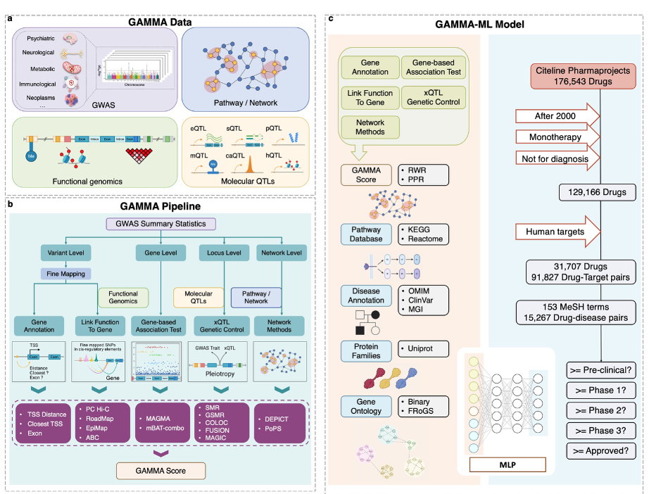

# Genetic Associations to Mechanisms and Medicine Analysis
**GAMMA Portal** is a comprehensive web-based platform designed for post-GWAS gene prioritization, drug target discovery, and predict their clinical success rates through systematic analysis of genome-wide association study (GWAS) summary statistics. **GAMMA** (Genetic Associations to Mechanisms and Medicine Analysis) implements a comprehensive suite of gene prioritization methods spanning four levels of genetic evidence: variant-level, gene-level, locus-level, and gene network-level analyses. The machine learning extension **GAMMA-ML** integrates multiple lines of genetic evidence from GAMMA and comprehensive gene-self characteristics to identify genes most likely to be valid therapeutic targets and predicts their probability of success in clinical development.




# Online GAMMA Analysis
**[GAMMA Portal](https://gamma.westlakefuturegene.com/)** (https://gamma.westlakefuturegene.com/) streamlines the gene prioritization process so that users only need to provide GWAS summary statistics for their trait of interest. Please see the tutorial for GWAS summary statistics input format (https://gamma.westlakefuturegene.com/doc/tutorial).

```
Test account: `gamma@test.com`
Test account password: `Test1234`
```

#### The platform implements the following methodological components:

1. `Gene-based association testing (GWAS)`: MAGMA and mBAT-combo methods that aggregate GWAS signals at the gene level while accounting for linkage disequilibrium structure.

2. `Variant-to-gene mapping (V2G)`: Fine-mapping approaches identify likely causal variants, which are then linked to target genes through functional annotations including gene proximity,exons, PCHi-C interactions, and enhancer-gene interactions predicted from ABC, EpiMap, RoadMap.

3. `Locus-to-gene prioritization (L2G)`: Integration of GWAS with xQTL data through summary-data-based Mendelian Randomization (SMR), colocalization (COLOC), transcriptome-wide association studies (FUSION), generalized summary-data-based Mendelian randomization (GSMR) and xMAGIC (https://github.com/jianyanglab/MAGIC).

4. `Network-based methods (Network)`: DEPICT and PoPS leverage protein-protein interaction networks and gene co-expression patterns to identify functionally related genes. GAMMA-RWR (Random Walk with Restart) and GAMMA-PPR (Personalized PageRank) scores that leverage protein-protein interaction network structure to identify functionally related genes.

For each gene-trait pair, GAMMA generates a score by counting the number of methods that prioritize the gene based on their respective statistical thresholds. A higher GAMMA score indicates stronger genetic evidence supporting the gene as a potential candidate gene and therapeutic target. 


# GAMMA-ML: Machine Learning Model for Clinical Success Prediction
GAMMA-ML is a machine learning model that extends beyond GWAS-based gene prioritization to incorporate comprehensive gene characteristics that influence clinical success. GAMMA-ML uses a multi-label regression framework to predict the success rate for gene-disease pairs across each clinical trial phase (preclinical, Phase I, Phase II, Phase III, and approval).

GAMMA-ML integrates 4,077 features across multiple categories:

1. `GWAS-based gene prioritization features`: 
    - All methods and scores from the GAMMA framework

2. `Disease database annotations`:
    - Mendelian disease annotations from OMIM
    - Pathogenic variant data from ClinVar
    - Mouse model disease associations from MGI
    - Cancer-specific features from COSMIC CGC, Intogen, and NCG
    
3. `Pathway and functional annotations`:
    - KEGG and Reactome pathways
    - UniProt protein family features (reduced to 500 principal components)
    - Gene Ontology annotations including 68 drug development-related terms and 256 pre-trained GO embeddings

4. `Gene expression data`:
    - Tissue-specific expression from GTEx and HPA
    - Single-cell expression data and subcellular localization
    - 256 pre-trained FRoGS (Functional Representation of Gene Signature) features

The model was trained on 4,096,610 gene-disease pairs using clinical trial data from Citeline Pharmaprojects, covering drugs added between 2000 and 2024. Our benchmark analysis demonstrates that GAMMA-ML is highly predictive: the top 1% of gene-disease pairs ranked by GAMMA-ML are 10.4-fold more likely to advance from Phase I to final approval, while the top 5% still show a nearly 5.0-fold increased likelihood of success.

# Data Security Statement
To ensure the security of your data, you must log in to submit your GWAS summary statistics for online GAMMA analysis. Uploaded user data will be accessible only to the users who uploaded it and can be removed by them at any time. If you have not yet registered, you can do so [here](https://gamma.westlakefuturegene.com/signup). For those interested, a demo is available on the "Create a Task" interface.

# Contact
Should you have any questions, suggestions, or encounter any issues, please reach out to us at Yang Lab (statgenlab@westlake.edu.cn) or Jian Yang (jian.yang@westlake.edu.cn).

We have provided the detail script for each analysis, please see [scripts](scripts/). And for the GAMMA pipeline, we provided the slurm cluster [sbatch script](deploy/GAMMA_sbatch.sh)  and dependent files in the [yaml files](deploy/GAMMA.yaml).

But we would like to recommend you to utilize our online [GAMMA portal](https://gamma.westlakefuturegene.com/), which has already fix the dependent data, packages, and environment. You just need to prepare a GWAS summary statistics there.


# Tutorial
We provide scripts for each analysis in the [scripts](scripts/) directory for researcher reference. For the full GAMMA pipeline on a Slurm cluster, see the sbatch script at [deploy/GAMMA_sbatch.sh](deploy/GAMMA_sbatch.sh) and its YAML config at [deploy/GAMMA.yaml](deploy/GAMMA.yaml).


> <font color="red"><strong>Recommendation:</strong></font> The easiest way to run GAMMA is via the online **[GAMMA Portal](https://gamma.westlakefuturegene.com/)** (https://gamma.westlakefuturegene.com/), which has already fix all the dependent data, packages, and environment. You only need to upload your GWAS summary statistics.

**Setup environments**
```
conda env create -f /environments/depict.yml && \
    conda env create -f /environments/pops.yml && \
    conda env create -f /environments/ldsc.yml && \
    conda env create -f /environments/NetworkX.yml && \
    conda env create -f /environments/py37.yml && \
    conda env create -f /environments/py39.yml

conda env create -f /environments/r.yml && \
    /bin/bash -c "source activate r && R -e 'devtools::install_github(\"ZikunY/CARMA\")' && \
    R -e 'remotes::install_github(\"gabraham/plink2R\", subdir=\"plink2R\", ref=\"master\")' && \
    R -e 'remotes::install_github(\"cotsapaslab/jlim\", subdir=\"jlimR\", ref=\"master\")'"
```

**Run pipeline**
```bash
## Input
GAMMA_HOME=/your/local/path

CONFIG_template=$1
trait_name=$2
GWAS_DATA=$3
WORK_DIR=${4:-"${GAMMA_HOME}/guoyazhou/GAMMA_git"}
OUTPUT=${5:-"${GAMMA_HOME}/guoyazhou/GAMMA_git_data"}
SCRIPT_DIR=${6:-"${GAMMA_HOME}/guoyazhou/GAMMA_github/gamma-script/scripts"}

## Config yaml file for each GWAS summary data
./scripts/config.sh \
    ./deploy/GAMMA.yaml \
    ${trait_name} \
    ${GWAS_DATA} \
    ${WORK_DIR} \
    ${OUTPUT} \
    ${SCRIPT_DIR}

## Validate/format GWAS data
./scripts/gwas_format.sh ${CONFIG}

## Launch the GAMMA pipeline via Slurm
CONFIG=${WORK_DIR}/yaml_file/${trait_name}.yaml 
./deploy/GAMMA_sbatch.sh ${CONFIG}
```


